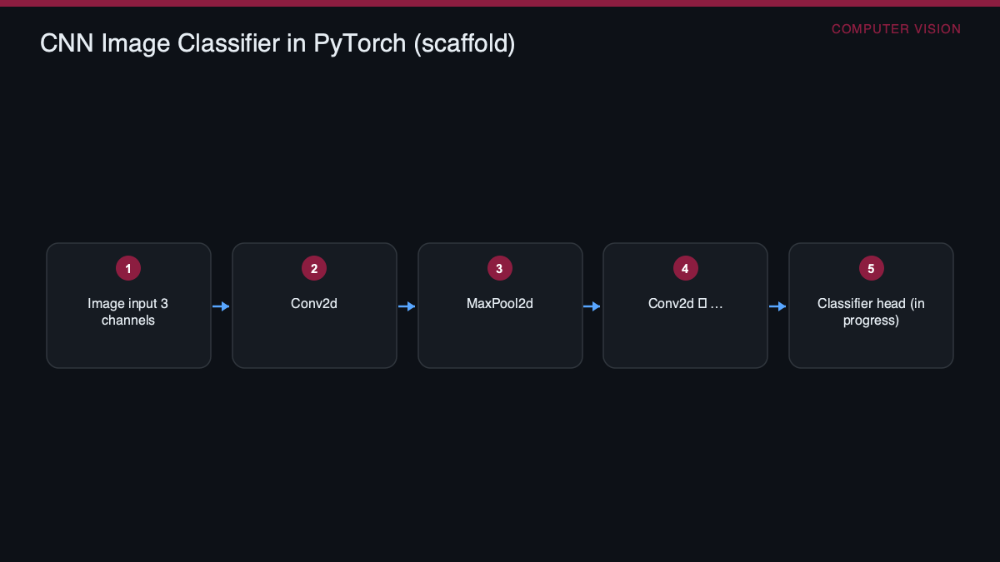

# Computer Vision & Deep Learning

> An early-stage PyTorch CNN scaffold for image classification coursework

    



### 🌐 Live project page → **https://selsaady1.github.io/computer-vision-deep-learning/**

## Overview
A short Colab/Jupyter notebook from a computer vision and deep learning course that begins defining a convolutional neural network in PyTorch. It sets up the imports and the opening layers of a CNN class intended for image input, representing the starting scaffold of a classifier rather than a finished model.

## Key Achievements
- Defines a CNN class subclassing torch.nn.Module in PyTorch
- Specifies convolutional layers (nn.Conv2d) starting from 3-channel image input and 2x2 max-pooling layers (nn.MaxPool2d)
- Imports the core PyTorch deep-learning stack (torch, torch.nn, torch.nn.functional)

## Approach
The notebook uses PyTorch's object-oriented module API, subclassing nn.Module and declaring layers (Conv2d, MaxPool2d) in the constructor. It is written in a Google Colab environment as the initial architecture-definition step of a convolutional network for image data.

## Tools & Technologies
- Python
- PyTorch (torch, torch.nn, torch.nn.functional)
- Jupyter Notebook
- Google Colab

## Repository Structure
```
.gitignore
.nojekyll
LICENSE
README.md
images/diagram.png
images/diagram.svg
index.html
src/Computer Vision & Deep Learning.ipynb
```

## Results
No results are documented: the notebook contains no forward pass, training loop, dataset, or cell outputs. It is an incomplete, early-stage architecture scaffold rather than a trained or evaluated model.

## Deliverable
See [`src/Computer Vision & Deep Learning.ipynb`](src/Computer%20Vision%20%26%20Deep%20Learning.ipynb).

## License
MIT — see [`LICENSE`](LICENSE).

---
_Part of [Saif Elsaady's engineering portfolio](https://selsaady1.github.io/portfolio/). Deliverables only — routine homework/quizzes/exams excluded._